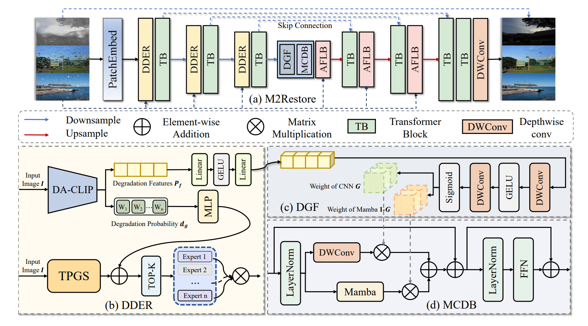
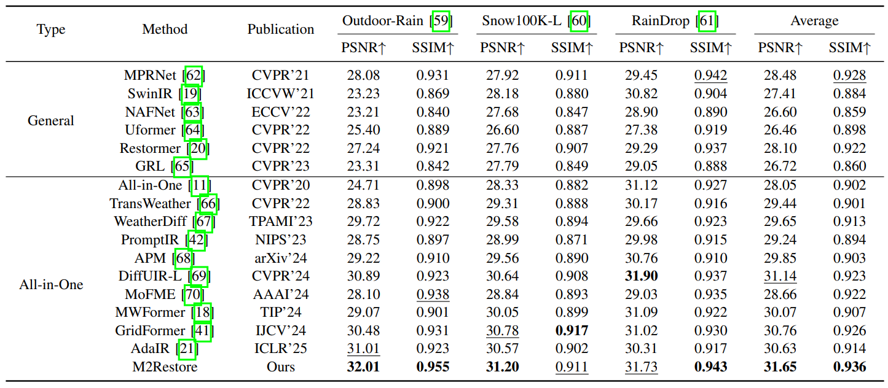
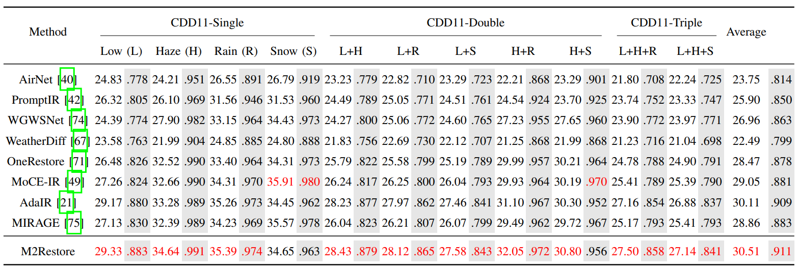

# M2Restore: Mixture-of-Experts-based Mamba-CNN Fusion Framework for All-in-One Image Restoration (TIP'2025)
Authors: Yongzhen Wang, Yongjun Li, Zhuoran Zheng, Xiao-Ping Zhang and Mingqiang Wei

[](https://arxiv.org/abs/2506.07814)
[](https://ieeexplore.ieee.org/document/11284756)

*__Notice__: This repo is still __working in progress__.*

<hr />

> **Abstract:** *Natural images are often degraded by complex, composite degradations such as rain, snow, and haze, which adversely impact downstream vision applications. While existing image restoration efforts have achieved notable success, they are still hindered by two critical challenges: limited generalization across dynamically varying degradation scenarios and a suboptimal balance between preserving local details and modeling global dependencies. To overcome these challenges, we propose M2Restore, a novel Mixture-of-Experts (MoE)-based Mamba-CNN fusion framework for efficient and robust all-in-one image restoration. M2Restore introduces three key contributions: First, to boost the model’s generalization across diverse degradation conditions, we exploit a CLIP-guided MoE gating mechanism that fuses task-conditioned prompts with CLIP-derived semantic priors. This mechanism is further refined via cross-modal feature calibration, which enables precise expert selection for various degradation types. Second, to jointly capture global contextual dependencies and fine-grained local details, we design a dual-stream architecture that integrates the localized representational strength of CNNs with the long-range modeling efficiency of Mamba. This integration enables collaborative optimization of global semantic relationships and local structural fidelity, preserving global coherence while enhancing detail restoration. Third, we introduce an edge-aware dynamic gating mechanism that adaptively balances global modeling and local enhancement by reallocating computational attention to degradation-sensitive regions. This targeted focus leads to more efficient and precise restoration. Extensive experiments across multiple image restoration benchmarks validate the superiority of M2Restore in both visual quality and quantitative performance.*
<hr />

## Network Architecture
 


## Install

Download this repository

```
git clone https://github.com/M2Restore.git
cd M2Restore
```

Create a conda enviroment:

```
ENV_NAME="m2restore"
conda create -n $ENV_NAME python=3.8
conda activate $ENV_NAME
```


## Training

After preparing the training data in ```data/``` directory, If you want to train M2Restore on the AllWeather dataset, use 
```
python train.py --dataset allweather
```
 If you want to train M2Restore on the CDD11 dataset, use 

```
python train.py --dataset cdd11
```

If you wish to change the dataset path, please refer to the config files in `./configs/dataset_cfg.py`.

## Testing

To perform the evaluation, use
```
python test.py
```
For specific settings, please refer to `./test.py`.

## Results

Performance results of the M2Restore framework trained under the all-in-one setting.

<details>
<summary><strong>Three Distinct Degradations</strong> (click to expand) </summary>
 
</details>
<details>
<summary><strong>Eleven Distinct Degradations</strong> (click to expand) </summary>
 
</details>


## Citation

If you use our work, please consider citing:
~~~
@ARTICLE{wang2025m2restore,
  author={Wang, Yongzhen and Li, Yongjun and Zheng, Zhuoran and Zhang, Xiao-Ping and Wei, Mingqiang},
  journal={IEEE Transactions on Image Processing}, 
  title={M2Restore: Mixture-of-Experts-based Mamba-CNN Fusion Framework for All-in-One Image Restoration}, 
  year={2025},
  volume={},
  number={},
  pages={1-15},
  keywords={M2Restore;Mixture-of-Experts;Mamba-CNN;all-in-one;CLIP-guided},
  doi={10.1109/TIP.2025.3638662}}
~~~


## Acknowledgement
This code is built on [PromptIR](https://github.com/va1shn9v/PromptIR) and [AdaIR](https://github.com/c-yn/AdaIR). 

